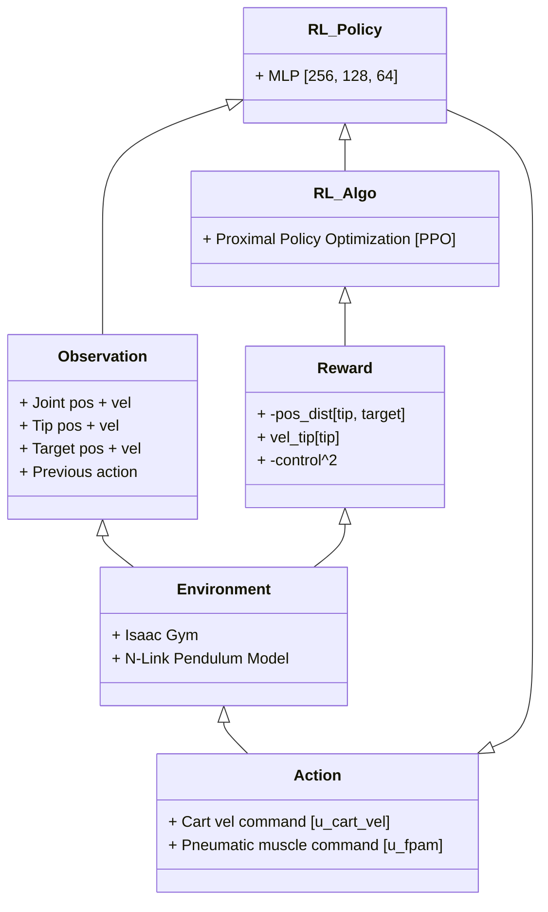

# Reinforcement Learning Enables Real-Time Planning and Control of Agile Maneuvers for Soft Robot Arms

<p align="center">
  
</p>

This repository contains the implementation of [Reinforcement Learning Enables Real-Time Planning and Control of Agile Maneuvers for Soft Robot Arms](https://sites.google.com/view/rl-soft-robot). This is the first work that demonstrates real-time planning and control of agile maneuvers by soft robot arms, which is achieved by using reinforcement learning and key insights with simulation and actuator modeling to overcome sim-to-real challenges for zero-shot sim-to-real transfer.

## Results (Feb 2023)

<p align="center">
  
  
</p>

## System Overview (Feb 2023)

<p align="center">
  
</p>

## How to run

### Installation

First, install isaacgym and isaacgymenvs. The following is a copy from the official isaacgymenvs repository installation instructions as of October 6, 2023. Reminder to install isaacgymenvs from this repository, not the official repository.

Download the Isaac Gym Preview 4 release from the [website](https://developer.nvidia.com/isaac-gym), then
follow the installation instructions in the documentation. We highly recommend using a conda environment 
to simplify set up.

Ensure that Isaac Gym works on your system by running one of the examples from the `python/examples` 
directory, like `joint_monkey.py`. Follow troubleshooting steps described in the Isaac Gym Preview 4
install instructions if you have any trouble running the samples.

Once Isaac Gym is installed and samples work within your current python environment, install this repo:

```bash
pip install -e .
```

### Run Training

Before training, please navigate to the `isaacgymenvs` folder, eg.

```
cd Vine_Robot_IsaacGymEnvs/isaacgymenvs
```

You can run the training in the same way as typical isaacgymenvs. For example:
```
python train.py task=Vine5LinkMovingBase wandb_activate=True wandb_entity=<your_wandb_entity> wandb_project=vine_robot wandb_name=new_train_0 max_iterations=1000 enable_viewer_sync_at_start=False OBSERVATION_TYPE=POS_AND_FD_VEL RAIL_P_GAIN=3.0 RAIL_SOFT_LIMIT=0.2 RAIL_VELOCITY_SCALE=0.8 CAPTURE_VIDEO=True
```

Note that we have added hydra tab completion. Run the following (or add to your `.bashrc`) to get [tab completion](https://github.com/NVIDIA-Omniverse/IsaacGymEnvs/pull/127):
```
eval "$(python train.py -sc install=bash)"
```

### Best Result for Free Space Target Reaching

```
python train.py task=Vine5LinkMovingBase wandb_activate=True wandb_entity=<your_wandb_entity> wandb_project=vine_robot_v3 wandb_name=FSTR_acc6_DR-act-001_suc-dist-0-04_ytar-4_no-theta-thetad_rsl0-25_max-ep-100_accel-noise-1-05_action-delay-1 max_iterations=600 CAPTURE_VIDEO=True enable_viewer_sync_at_start=False RAIL_SOFT_LIMIT=.25 RAIL_P_GAIN=30.0 RAIL_ACCELERATION=6.0 task.env.RAIL_VELOCITY_SCALE=1.0 task.env.CREATE_SHELF=False task.env.CREATE_PIPE=False vine_randomize=True task.env.USE_NONZERO_CONTACT_FORCE_RESET=False task.env.CONTACT_FORCE_REWARD_WEIGHT=0.0 task.env.USE_TARGET_REACHED_RESET=True task.env.MIN_TARGET_DEPTH_IN_OBSTACLE=0.0 task.env.MAX_TARGET_DEPTH_IN_OBSTACLE=0.0 task.env.OBSERVATION_TYPE=TIP_AND_CART_AND_OBJ_INFO task.env.ACTION_DELAY=1 task.env.maxEpisodeLength=100 task.env.SUCCESS_DIST=0.04 task.env.MIN_TARGET_Y=-.4 task.env.MAX_TARGET_Y=.4 task.env.MIN_TARGET_Z=.55 task.env.MAX_TARGET_Z=.7 task.task.randomization_parameters.DYNAMICS_SCALING_MIN=0.999999 task.task.randomization_parameters.DYNAMICS_SCALING_MAX=1.000001 task.task.randomization_parameters.ACTION_NOISE_STD=0.001 task.task.randomization_parameters.OBSERVATION_NOISE_STD=0.0 task.task.randomization_parameters.ACCEL_TARGET_SCALING_MIN=0.99 task.task.randomization_parameters.ACCEL_TARGET_SCALING_MAX=1.05
```

### Best Result for Shelf Target Reaching

```
python train.py task=Vine5LinkMovingBase wandb_activate=True wandb_entity=<your_wandb_entity> wandb_project=vine_robot_v3 wandb_name=ABLATION_4l48ph5o_shelf_action-delay-1_no-theta-thetad_dractions-01 max_iterations=500 CAPTURE_VIDEO=True enable_viewer_sync_at_start=False RAIL_SOFT_LIMIT=.25 RAIL_P_GAIN=30.0 RAIL_ACCELERATION=6.0 task.env.RAIL_VELOCITY_SCALE=1.0 task.env.CREATE_SHELF=True task.env.CREATE_PIPE=False vine_randomize=True task.env.USE_NONZERO_CONTACT_FORCE_RESET=False task.env.CONTACT_FORCE_REWARD_WEIGHT=0.0 task.env.USE_TARGET_REACHED_RESET=True task.env.MIN_TARGET_DEPTH_IN_OBSTACLE=-0.05 task.env.MAX_TARGET_DEPTH_IN_OBSTACLE=0.2 task.env.OBSERVATION_TYPE=TIP_AND_CART_AND_OBJ_INFO task.env.ACTION_DELAY=1 task.task.randomization_parameters.DYNAMICS_SCALING_MIN=0.999999 task.task.randomization_parameters.DYNAMICS_SCALING_MAX=1.000001 task.task.randomization_parameters.ACTION_NOISE_STD=0.01
```

## Helpful Notes

* We use wandb extensively in this codebase, so we highly recommend setting up an account and using it. We log rewards over iterations, breakdowns of weighted and unweighted reward terms (for reward tuning), videos of the robot in the training process, observations, and more.

* For the paper submission, we added additional visual links to make the sim look more visually appealing on another [branch](https://github.com/tylerlum/Vine_Robot_IsaacGymEnvs/pull/31). 

<br>
<br>
<br>
<br>

## Early Results (Jan 2023)

<p align="center">
  
  

  
  
  
  
  
</p>

## Rough RL Training Diagram (Jan 2023)

Below is a high-level diagram of the reinforcement learning system used to train the control policy. 



______________________________________________________________________

Below is the original README contents from the general Isaac Gym Environments repository.

# Isaac Gym Benchmark Environments

<details>
<summary>CLICK TO OPEN</summary>

[Website](https://developer.nvidia.com/isaac-gym) | [Technical Paper](https://arxiv.org/abs/2108.10470) | [Videos](https://sites.google.com/view/isaacgym-nvidia)

### About this repository

This repository contains example RL environments for the NVIDIA Isaac Gym high performance environments described [in our NeurIPS 2021 Datasets and Benchmarks paper](https://openreview.net/forum?id=fgFBtYgJQX_)

### Installation

Download the Isaac Gym Preview 4 release from the [website](https://developer.nvidia.com/isaac-gym), then
follow the installation instructions in the documentation. We highly recommend using a conda environment
to simplify set up.

Ensure that Isaac Gym works on your system by running one of the examples from the `python/examples`
directory, like `joint_monkey.py`. Follow troubleshooting steps described in the Isaac Gym Preview 4
install instructions if you have any trouble running the samples.

Once Isaac Gym is installed and samples work within your current python environment, install this repo:

```bash
pip install -e .
```

### Creating an environment

We offer an easy-to-use API for creating preset vectorized environments. For more info on what an vectorized environment is and its usage, please refer to the Gym's [documentation](https://www.gymlibrary.ml/content/vector_api/).

```python
import isaacgym
import isaacgymenvs
import torch

envs = isaacgymenvs.make(
	seed=0,
	task="Ant",
	num_envs=2000,
	sim_device="cuda:0",
	rl_device="cuda:0",
)
print("Observation space is", envs.observation_space)
print("Action space is", envs.action_space)
obs = envs.reset()
for _ in range(20):
	obs, reward, done, info = envs.step(
		torch.rand((2000,)+envs.action_space.shape, device="cuda:0")
	)
```

### Running the benchmarks

To train your first policy, run this line:

```bash
python train.py task=Cartpole
```

Cartpole should train to the point that the pole stays upright within a few seconds of starting.

Here's another example - Ant locomotion:

```bash
python train.py task=Ant
```

Note that by default we show a preview window, which will usually slow down training. You
can use the `v` key while running to disable viewer updates and allow training to proceed
faster. Hit the `v` key again to resume viewing after a few seconds of training, once the
ants have learned to run a bit better.

Use the `esc` key or close the viewer window to stop training early.

Alternatively, you can train headlessly, as follows:

```bash
python train.py task=Ant headless=True
```

Ant may take a minute or two to train a policy you can run. When running headlessly, you
can stop it early using Control-C in the command line window.

### Loading trained models // Checkpoints

Checkpoints are saved in the folder `runs/EXPERIMENT_NAME/nn` where `EXPERIMENT_NAME`
defaults to the task name, but can also be overridden via the `experiment` argument.

To load a trained checkpoint and continue training, use the `checkpoint` argument:

```bash
python train.py task=Ant checkpoint=runs/Ant/nn/Ant.pth
```

To load a trained checkpoint and only perform inference (no training), pass `test=True`
as an argument, along with the checkpoint name. To avoid rendering overhead, you may
also want to run with fewer environments using `num_envs=64`:

```bash
python train.py task=Ant checkpoint=runs/Ant/nn/Ant.pth test=True num_envs=64
```

Note that If there are special characters such as `[` or `=` in the checkpoint names,
you will need to escape them and put quotes around the string. For example,
`checkpoint="./runs/Ant/nn/last_Antep\=501rew\[5981.31\].pth"`

### Configuration and command line arguments

We use [Hydra](https://hydra.cc/docs/intro/) to manage the config. Note that this has some
differences from previous incarnations in older versions of Isaac Gym.

Key arguments to the `train.py` script are:

- `task=TASK` - selects which task to use. Any of `AllegroHand`, `Ant`, `Anymal`, `AnymalTerrain`, `BallBalance`, `Cartpole`, `FrankaCabinet`, `Humanoid`, `Ingenuity` `Quadcopter`, `ShadowHand`, `ShadowHandOpenAI_FF`, `ShadowHandOpenAI_LSTM`, and `Trifinger` (these correspond to the config for each environment in the folder `isaacgymenvs/config/task`)
- `train=TRAIN` - selects which training config to use. Will automatically default to the correct config for the environment (ie. `<TASK>PPO`).
- `num_envs=NUM_ENVS` - selects the number of environments to use (overriding the default number of environments set in the task config).
- `seed=SEED` - sets a seed value for randomizations, and overrides the default seed set up in the task config
- `sim_device=SIM_DEVICE_TYPE` - Device used for physics simulation. Set to `cuda:0` (default) to use GPU and to `cpu` for CPU. Follows PyTorch-like device syntax.
- `rl_device=RL_DEVICE` - Which device / ID to use for the RL algorithm. Defaults to `cuda:0`, and also follows PyTorch-like device syntax.
- `graphics_device_id=GRAPHICS_DEVICE_ID` - Which Vulkan graphics device ID to use for rendering. Defaults to 0. **Note** - this may be different from CUDA device ID, and does **not** follow PyTorch-like device syntax.
- `pipeline=PIPELINE` - Which API pipeline to use. Defaults to `gpu`, can also set to `cpu`. When using the `gpu` pipeline, all data stays on the GPU and everything runs as fast as possible. When using the `cpu` pipeline, simulation can run on either CPU or GPU, depending on the `sim_device` setting, but a copy of the data is always made on the CPU at every step.
- `test=TEST`- If set to `True`, only runs inference on the policy and does not do any training.
- `checkpoint=CHECKPOINT_PATH` - Set to path to the checkpoint to load for training or testing.
- `headless=HEADLESS` - Whether to run in headless mode.
- `experiment=EXPERIMENT` - Sets the name of the experiment.
- `max_iterations=MAX_ITERATIONS` - Sets how many iterations to run for. Reasonable defaults are provided for the provided environments.

Hydra also allows setting variables inside config files directly as command line arguments. As an example, to set the discount rate for a rl_games training run, you can use `train.params.config.gamma=0.999`. Similarly, variables in task configs can also be set. For example, `task.env.enableDebugVis=True`.

#### Hydra Notes

Default values for each of these are found in the `isaacgymenvs/config/config.yaml` file.

The way that the `task` and `train` portions of the config works are through the use of config groups.
You can learn more about how these work [here](https://hydra.cc/docs/tutorials/structured_config/config_groups/)
The actual configs for `task` are in `isaacgymenvs/config/task/<TASK>.yaml` and for train in `isaacgymenvs/config/train/<TASK>PPO.yaml`.

In some places in the config you will find other variables referenced (for example,
`num_actors: ${....task.env.numEnvs}`). Each `.` represents going one level up in the config hierarchy.
This is documented fully [here](https://omegaconf.readthedocs.io/en/latest/usage.html#variable-interpolation).

## Tasks

Source code for tasks can be found in `isaacgymenvs/tasks`.

Each task subclasses the `VecEnv` base class in `isaacgymenvs/base/vec_task.py`.

Refer to [docs/framework.md](docs/framework.md) for how to create your own tasks.

Full details on each of the tasks available can be found in the [RL examples documentation](docs/rl_examples.md).

## Domain Randomization

IsaacGymEnvs includes a framework for Domain Randomization to improve Sim-to-Real transfer of trained
RL policies. You can read more about it [here](docs/domain_randomization.md).

## Reproducibility and Determinism

If deterministic training of RL policies is important for your work, you may wish to review our [Reproducibility and Determinism Documentation](docs/reproducibility.md).

## Multi-GPU Training

You can run multi-GPU training on NGC using `torchrun` (i.e., `torch.distributed`) using this repository.

Here is an example command for how to run in this way -
`torchrun --standalone --nnodes=1 --nproc_per_node=2 train.py multi_gpu=True task=Ant <OTHER_ARGS>`

Where the `--nproc_per_node=` flag specifies how many processes to run and note the `multi_gpu=True` flag must be set on the train script in order for multi-GPU training to run.

## WandB support

You can run [WandB](https://wandb.ai/) with Isaac Gym Envs by setting `wandb_activate=True` flag from the command line. You can set the group, name, entity, and project for the run by setting the `wandb_group`, `wandb_name`, `wandb_entity` and `wandb_project` set. Make sure you have WandB installed with `pip install wandb` before activating.

## Capture videos

We implement the standard `env.render(mode='rgb_rray')` `gym` API to provide an image of the simulator viewer. Additionally, we can leverage `gym.wrappers.RecordVideo` to help record videos that shows agent's gameplay. Consider running the following file which should produce a video in the `videos` folder.

```python
import gym
import isaacgym
import isaacgymenvs
import torch

envs = isaacgymenvs.make(
	seed=0,
	task="Ant",
	num_envs=20,
	sim_device="cuda:0",
	rl_device="cuda:0",
	graphics_device_id=0,
	headless=False,
	multi_gpu=False,
	virtual_screen_capture=True,
	force_render=False,
)
envs.is_vector_env = True
envs = gym.wrappers.RecordVideo(
	envs,
	"./videos",
	step_trigger=lambda step: step % 10000 == 0, # record the videos every 10000 steps
	video_length=100  # for each video record up to 100 steps
)
envs.reset()
print("the image of Isaac Gym viewer is an array of shape", envs.render(mode="rgb_array").shape)
for _ in range(100):
	envs.step(
		torch.rand((20,)+envs.action_space.shape, device="cuda:0")
	)
```

## Capture videos during training

You can automatically capture the videos of the agents gameplay by toggling the `capture_video=True` flag and tune the capture frequency `capture_video_freq=1500` and video length via `capture_video_len=100`. You can set `force_render=False` to disable rendering when the videos are not captured.

```
python train.py capture_video=True capture_video_freq=1500 capture_video_len=100 force_render=False
```

You can also automatically upload the videos to Weights and Biases:

```
python train.py task=Ant wandb_activate=True wandb_entity=nvidia wandb_project=rl_games capture_video=True force_render=False
```

## Pre-commit

We use [pre-commit](https://pre-commit.com/) to helps us automate short tasks that improve code quality. Before making a commit to the repository, please ensure `pre-commit run --all-files` runs without error.

## Troubleshooting

Please review the Isaac Gym installation instructions first if you run into any issues.

You can either submit issues through GitHub or through the [Isaac Gym forum here](https://forums.developer.nvidia.com/c/agx-autonomous-machines/isaac/isaac-gym/322).

## Citing

Please cite this work as:

```
@misc{makoviychuk2021isaac,
      title={Isaac Gym: High Performance GPU-Based Physics Simulation For Robot Learning},
      author={Viktor Makoviychuk and Lukasz Wawrzyniak and Yunrong Guo and Michelle Lu and Kier Storey and Miles Macklin and David Hoeller and Nikita Rudin and Arthur Allshire and Ankur Handa and Gavriel State},
      year={2021},
      journal={arXiv preprint arXiv:2108.10470}
}
```

**Note** if you use the ANYmal rough terrain environment in your work, please ensure you cite the following work:

```
@misc{rudin2021learning,
      title={Learning to Walk in Minutes Using Massively Parallel Deep Reinforcement Learning},
      author={Nikita Rudin and David Hoeller and Philipp Reist and Marco Hutter},
      year={2021},
      journal = {arXiv preprint arXiv:2109.11978}
}
```

If you use the Trifinger environment in your work, please ensure you cite the following work:

```
@misc{isaacgym-trifinger,
  title     = {{Transferring Dexterous Manipulation from GPU Simulation to a Remote Real-World TriFinger}},
  author    = {Allshire, Arthur and Mittal, Mayank and Lodaya, Varun and Makoviychuk, Viktor and Makoviichuk, Denys and Widmaier, Felix and Wuthrich, Manuel and Bauer, Stefan and Handa, Ankur and Garg, Animesh},
  year      = {2021},
  journal = {arXiv preprint arXiv:2108.09779}
}
```

If you use the AMP: Adversarial Motion Priors environment in your work, please ensure you cite the following work:

```
@article{
	2021-TOG-AMP,
	author = {Peng, Xue Bin and Ma, Ze and Abbeel, Pieter and Levine, Sergey and Kanazawa, Angjoo},
	title = {AMP: Adversarial Motion Priors for Stylized Physics-Based Character Control},
	journal = {ACM Trans. Graph.},
	issue_date = {August 2021},
	volume = {40},
	number = {4},
	month = jul,
	year = {2021},
	articleno = {1},
	numpages = {15},
	url = {http://doi.acm.org/10.1145/3450626.3459670},
	doi = {10.1145/3450626.3459670},
	publisher = {ACM},
	address = {New York, NY, USA},
	keywords = {motion control, physics-based character animation, reinforcement learning},
}
```

If you use the Factory simulation methods (e.g., SDF collisions, contact reduction) or Factory learning tools (e.g., assets, environments, or controllers) in your work, please cite the following paper:

```
@inproceedings{
	narang2022factory,
	author = {Yashraj Narang and Kier Storey and Iretiayo Akinola and Miles Macklin and Philipp Reist and Lukasz Wawrzyniak and Yunrong Guo and Adam Moravanszky and Gavriel State and Michelle Lu and Ankur Handa and Dieter Fox},
	title = {Factory: Fast contact for robotic assembly},
	booktitle = {Robotics: Science and Systems},
	year = {2022}
}
```
</details>
